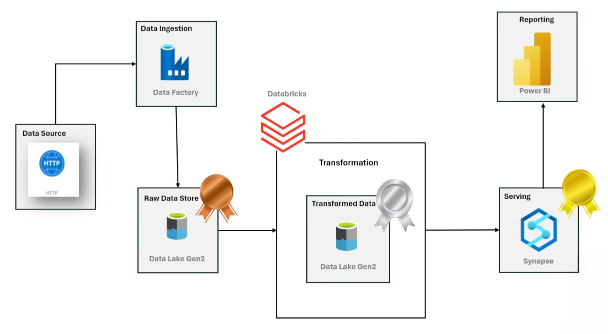
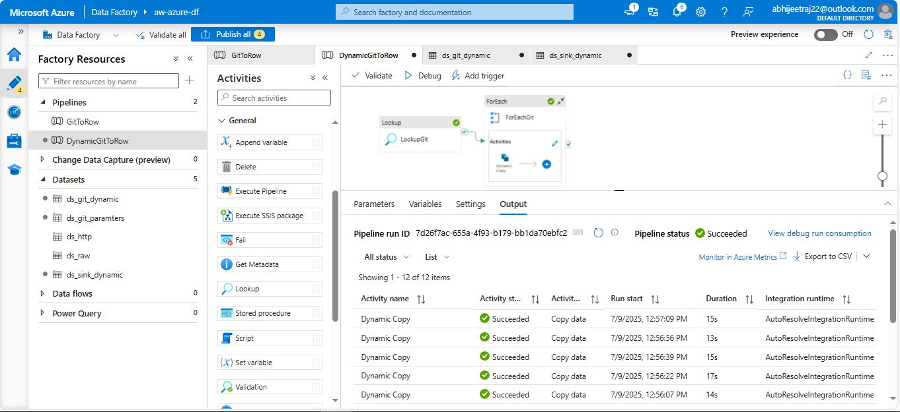
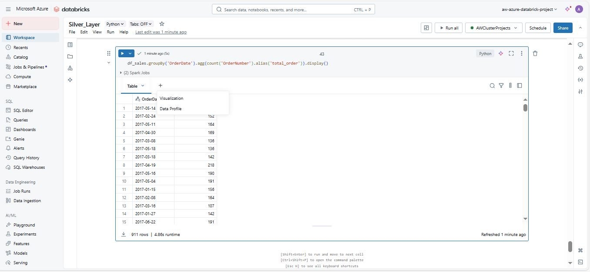
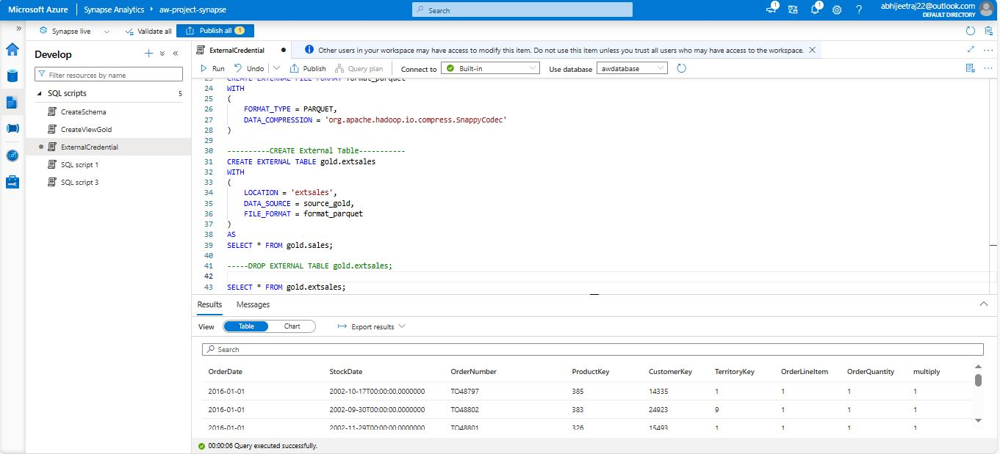
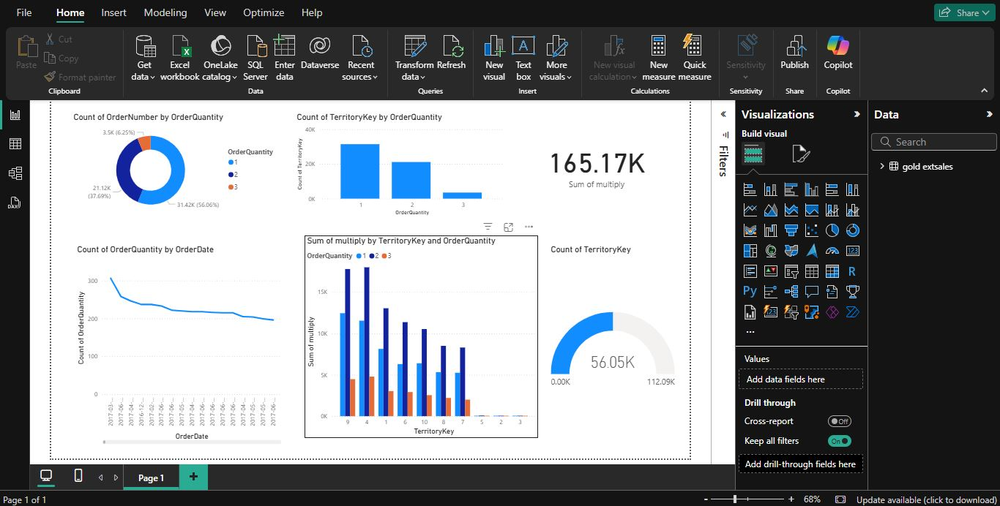

# 🌐 Azure Data Pipeline with ADF Databricks & Synapse (Adventure Works Data)


An end-to-end data engineering solution built on Azure, implementing the Medallion Architecture and demonstrating a complete pipeline from data ingestion to business intelligence.

> GitHub Repo: [Azure Data Pipeline with ADF Databricks & Synapse](https://github.com/abhijeetraj22/Azure-Data-Pipeline-with-ADF-Databricks-Synapse)

---

## 🧭 Architecture Overview

<p align="center">
  
  <br>
</p>

##
This architecture follows the **Bronze → Silver → Gold** model and consists of:

1. **Data Source**: Public GitHub repository hosting CSV data (Sales, Customers, Products)
2. **Data Ingestion**: Azure Data Factory (ADF) pulls data using the HTTP connector
3. **Raw Data Store**: Bronze layer in Azure Data Lake Gen2
4. **Transformation**: Azure Databricks (PySpark) performs cleaning and enrichment
5. **Serving**: Transformed Gold data served via Azure Synapse Analytics
6. **Reporting**: Power BI dashboards consuming Synapse views

---

## ⚙️ Tech Stack Used

| Layer            | Azure Service          | Purpose                                     |
|------------------|------------------------|---------------------------------------------|
| Data Ingestion   | **Azure Data Factory** | Ingest CSV files from GitHub (HTTP Source) |
| Raw Storage      | **ADLS Gen2 - Bronze** | Store unprocessed/raw data                  |
| Transformation   | **Azure Databricks**   | Clean, enrich, and join datasets using Spark |
| Processed Storage| **ADLS Gen2 - Silver/Gold** | Hold clean & modeled datasets           |
| Serving Layer    | **Azure Synapse**      | Queryable analytics layer (external tables) |
| Reporting        | **Power BI**           | Dashboards for insights                     |

---

## 📁 Repository Structure

```bash
Azure-Data-Pipeline-with-ADF-Databricks-Synapse/
│
├── README.md                      # This file
│
├───Code/
│   ├───Bronze/                    # ADF configurations for raw layer
│   │   ├───pipeline/              # Pipelines: DynamicGitToRow.json, GitToRow.json
│   │   ├───dataset/               # ADF datasets for source/sink/param
│   │   ├───linkedService/         # ADF linked services: HTTP, ADLS
│   │   ├───factory/               # Factory definition JSON
│   │   ├───Microsoft.DataFactory/ # Template and parameter JSONs for ARM deployment
│   │   └── demo.txt, git.json, publish_config.json
│
│   ├───Silver/                    # Databricks notebooks and templates
│   │   ├── Silver_Layer.ipynb     # Main transformation notebook
│   │   ├── silver_layer_refer.ipynb, Silver_Layer.py
│   │   └───Demo-RG_aw-azure-databrick-project/ # ARM template for Databricks
│
│   ├───Gold/                      # Synapse configurations
│   │   ├───sqlscript/             # SQL scripts: CreateSchema, CreateView, ExternalCredential
│   │   ├───linkedService/         # Synapse default linked services
│   │   ├───integrationRuntime/    # IR setup
│   │   ├───credential/            # Synapse credential config
│   │   └── Demo.txt, publish_config.json
│
├───Data/                          # Raw CSV files from AdventureWorks dataset
│   ├── AdventureWorks_Sales_2015.csv
│   ├── AdventureWorks_Customers.csv
│   ├── AdventureWorks_Products.csv
│   ├── AdventureWorks_Returns.csv
│   ├── AdventureWorks_Territories.csv
│   └── etc...
```
---
## 🔧 Key Functionalities

| Functionality                             | Description                                                                                                        |
| ----------------------------------------- | ------------------------------------------------------------------------------------------------------------------ |
| **HTTP-Based Data Ingestion**             | Uses Azure Data Factory (ADF) to fetch raw CSV files from GitHub via HTTP.                                         |
| **Dynamic Pipeline Execution**            | ADF pipeline is parameterized to loop through multiple files using a Lookup + ForEach pattern.                     |
| **Raw Data Storage**                      | Ingested data is stored in **Bronze layer** (ADLS Gen2), preserving the raw form.                                  |
| **Data Transformation (PySpark)**         | Databricks notebooks clean, deduplicate, and join datasets into **Silver** (cleaned) and **Gold** (modeled) zones. |
| **Data Serving via Synapse**              | External tables are created over Gold zone data for analysis using Azure Synapse Analytics.                        |
| **Reporting via Power BI**                | Power BI connects to Synapse to build interactive dashboards from the Gold data layer.                             |
| **Medallion Architecture Implementation** | Enforces best practices in modern data lake architecture using Bronze → Silver → Gold separation.                  |
| **Infra as Code**                         | JSON templates and ARM files are included to deploy ADF, Synapse, and Databricks components.                       |

---

## 🛠️ Step-by-Step Pipeline Flow

### 🔹 Step 1: Data Source
- Source: Public GitHub repo with AdventureWorks CSVs (Sales, Returns, Products, Customers)
- Files include: `Sales2015.csv`, `Sales2016.csv`, `Returns.csv`, `Products.csv`

### 🔹 Step 2: Data Ingestion via ADF
- Use **HTTP connector** in ADF
- Parameterized **dynamic pipeline** with Lookup + ForEach
- Data stored in **Bronze layer** of ADLS

### 📸 Azure Data Factory
<p align="center">
  
  <br>
</p>

### 🔹 Step 3: Transformation via Databricks
- Read raw data from Bronze
- Apply:
  - Null removal
  - Data type conversions
  - Joins with dimension tables
- Write clean data to **Silver**
- Write modeled facts/dims to **Gold**

### 📸 Azure Databricks
<p align="center">
  
  <br>
</p>

### 🔹 Step 4: Serving Layer (Synapse)
- Create **external tables** on Gold data
- Enable BI connectivity using **SQL queries**

### 📸 Azure Synapse
<p align="center">
  
  <br>
</p>

### 🔹 Step 5: Reporting with Power BI
- Connect to Synapse
- Build interactive dashboards using cleaned & aggregated data

### 📸 PowerBI Demo
<p align="center">
  
  <br>
</p>

---
## 💰 Cost & Pricing

| Service        | Cost Structure                                                 |
| -------------- | -------------------------------------------------------------- |
| **ADF**        | Pay-per-activity (e.g. Copy, Data Flow runtime hours)          |
| **Databricks** | Pay-per-cluster runtime (interactive, job)                     |
| **Synapse**    | Pay-per-use (serverless) or reserved capacity (dedicated pool) |


---
## Connect with me! 🌐

[](https://www.linkedin.com/in/rajabhijeet22/)       [](https://github.com/abhijeetraj22)     [](https://www.instagram.com/abhijeet_raj_/?hl=en) [](https://twitter.com/abhijeet_raj_/)


